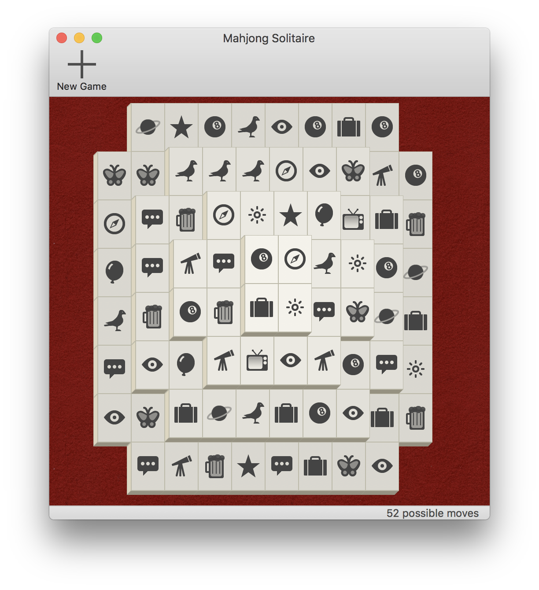

Mahjong-Solitaire
=================

An open source, lightweight and clean implementation of the Mahjong Solitaire for macOS.

This was an experiment to evaluate how costly would it be to write a game using only NSViews and other Cocoa widgets.

Yes, this game uses NSViews instead of a game engine. =)

### Screenshot

